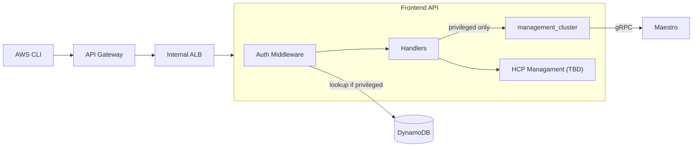

# ROSA Regional Frontend API

Stateless gateway API for ROSA HCP regional cluster management.

## Architecture



## Endpoints

| Endpoint                               | Auth       | Description                                  |
| -------------------------------------- | ---------- | -------------------------------------------- |
| `POST /api/v0/management_clusters`     | privileged | Create management cluster (Maestro consumer) |
| `GET /api/v0/management_clusters`      | privileged | List management clusters                     |
| `GET /api/v0/management_clusters/{id}` | privileged | Get management cluster                       |

## Configuration

| Flag                | Default                  | Description     |
| ------------------- | ------------------------ | --------------- |
| `--api-port`        | 8000                     | API server port |
| `--maestro-url`     | `http://maestro:8000`    | Maestro API URL |
| `--dynamodb-table`  | `rosa-customer-accounts` | DynamoDB table  |
| `--dynamodb-region` | `us-east-1`              | AWS region      |

## Build

```bash
make build
make test
make image
```
